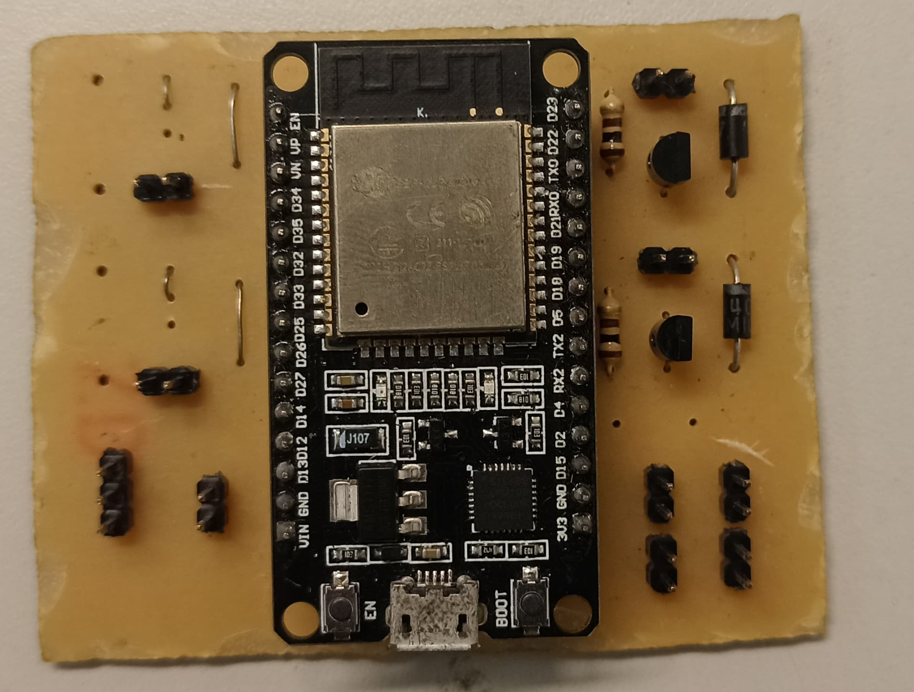

# ⚙️ Componentes do Projeto Elétrico

- 🧠 **1x ESP32** – o cérebro do hovercraft
- 🔋 **2x Baterias de íon-lítio** – para alimentar o ESP32 e o Servo Motor
- 🔋 **1x Bateria LiPo** – dedicada à propulsão
- 🌀 **2x Motores BLDC** – um para aceleração e outro para sustentação
- 📦 **2x Drivers de motor XXXXXXXXX** – controlam os BLDCs
- 🕹️ **1x Servo motor** – para controlar a direção
- ⚡  **1x PCB** - Para distribuir a energia e os sinais

## 🖼️ Fotos dos Componentes
| Componente        | Imagem                                                                 |
|-------------------|------------------------------------------------------------------------|
| 📟 **PCB (placa de circuito)**   |                     |
| ⚙️ **Driver de motor (XXXXXXXX)** |               |
| 🌀 **Motor BLDC**                |        |
